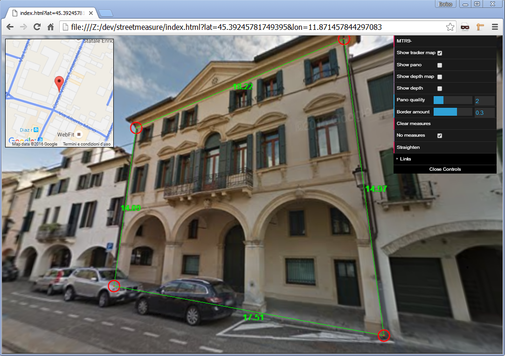
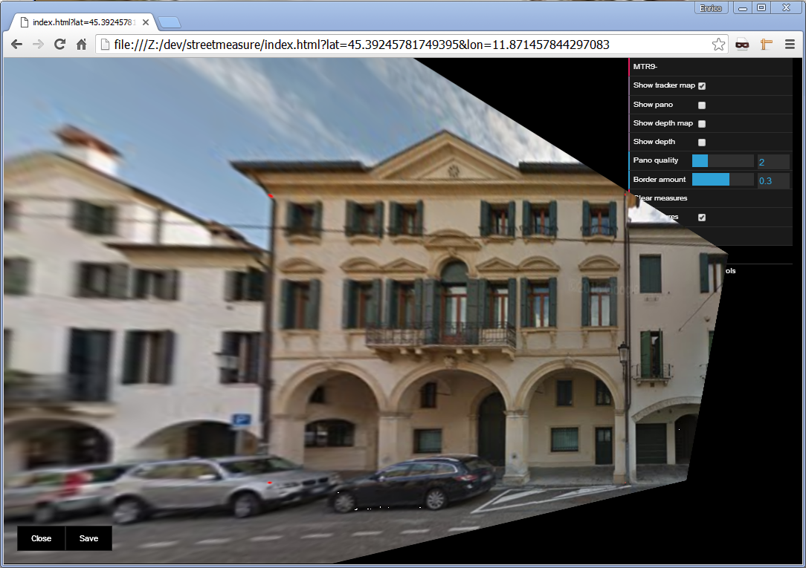

# streetmeasure #

[streetmeasure](http://enricofer.github.io/streetmeasure) is an experimental javascript app that allows to take measures on google street panoramas and extract and straighten portions of the images. 

## credits ##
It is built on top of @callumprentice [works](http://callumprentice.github.io/) expecially "Street Cloud Interactive" and relies on the following javascript tools:

- [THREE.js](https://threejs.org/) for 3d visualization
- [PanomNom.js](https://github.com/spite/PanomNom.js) for panorama fetching
- [GSVPanoDepth.js](https://github.com/proog128/GSVPanoDepth.js) for depth maps fetching
- [glfx.js](https://github.com/evanw/glfx.js) for perspective reprojecting

## usage ##
start with panoid parameter if known
    http://enricofer.github.io/streetmeasure/?panoid=cFR_vriBYmaHXq6-SctOxA
or lon and lat parameters
    https://enricofer.github.io/streetmeasure/?lat=45.39245781749395&lon=11.871457844297083

If the provided panoid is valid or the requested lon and lat is covered by google street view service, will be loaded the panorama location as equirectangular projection on witch is possible to obtain measures on the panorama. Double clicking on panorama makes a measurement point. With further double clicks distances (meters) between measurements points are obtained. 

Four measurements points shape an extraction polygon assumed to be a rectangle in the reality used as guide for straightening the panorama image. The points for a right image processing must be provided counterclockwise from bottom/left to bottom/right to top/right to top/left.

Double clicking on tracker map or on arrows on screen to move panorama without leaving the application.

On the right there is a menu with the following function:

- Show on/off the top left tracker map panel
- Show on/off the middle left equirectangular panorama image panel
- Show on/off the bottom left equirectangular depth map image panel
- Show on/off the depth map image projected over the panorama image (measurements are possible only where there a 3d model covering of the sample point)
- *Pano_quality* to choose between best resolution (5) and performance (1)
- *Border_amount* to determine how much image to be straighten around the four measurements points
- *Clear_measures* to clear measures from screen
- *No measures* to include or not measures on straighten image
- *Straighten* to do the magic

## Licence ##
The procedures used in the app broke almost all Google Streetview service terms of use so I hope no one will use it on production. It's just a game.